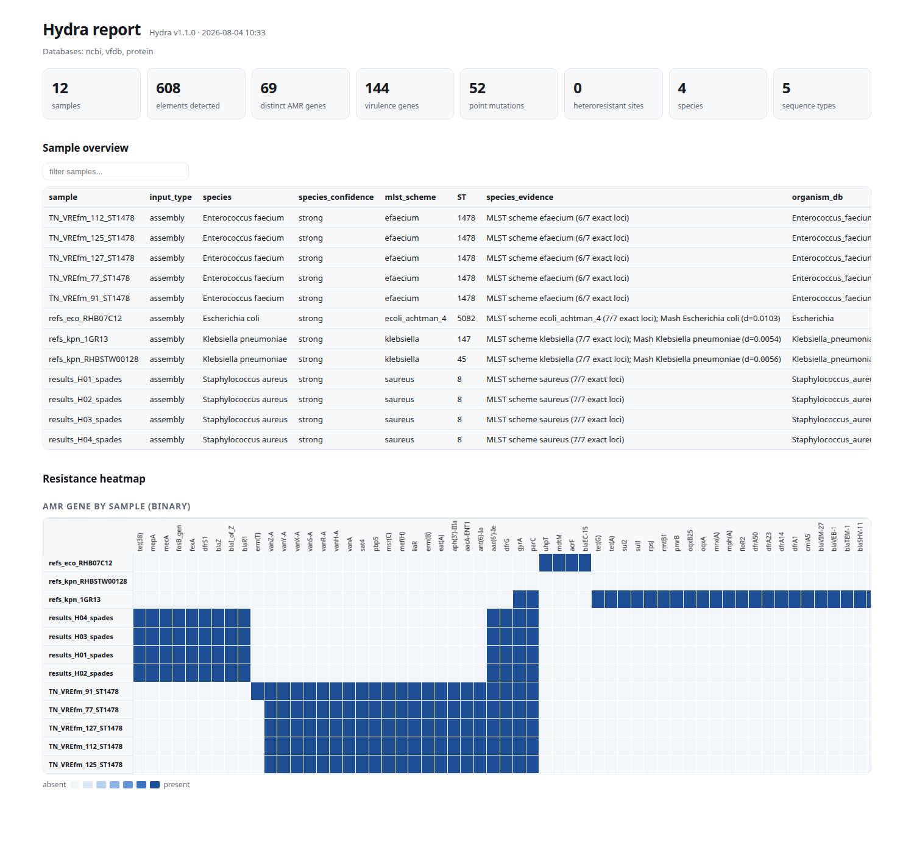

<p align="center">
  
</p>

<h1 align="center">Hydra</h1>

<p align="center">
  <strong>One pass over one set of databases: acquired resistance and virulence genes,
  resistance point mutations, heteroresistance from reads, MLST, and lineage typing —
  for assemblies or raw reads, one sample or a thousand.</strong>
</p>

<p align="center">
  <a href="#install">Install</a> ·
  <a href="#quick-start">Quick start</a> ·
  <a href="#what-hydra-does">What it does</a> ·
  <a href="#what-the-output-looks-like">Output</a> ·
  <a href="#heteroresistance">Heteroresistance</a> ·
  <a href="#outputs">Outputs</a> ·
  <a href="#presets">Presets</a> ·
  <a href="#command-reference">Commands</a> ·
  <a href="#performance">Performance</a> ·
  <a href="#how-it-works">Methods</a>
</p>

---

## Why

Characterising a bacterial isolate normally means running four or five tools, each
with its own database, its own thresholds, and its own output layout, then writing
a script to glue the answers together. Hydra does the whole job in one command and
one table, and adds the one thing none of those tools can do from an assembly:
**it finds resistance mutations that are present in only some copies of a gene.**

## What Hydra does

| | |
|---|---|
| **Acquired genes** | NCBI, CARD, ResFinder, ARG-ANNOT, MEGARes, VFDB, PlasmidFinder, EcOH, *E. coli* VF — screened together, with drug-class annotation transferred onto every database |
| **Translated search** | curated protein reference searched by translation, with `--plus` stress-response and virulence elements |
| **Point mutations** | Organism-specific protein and DNA catalogues: *gyrA*, *parC*, *rpoB*, *pmrB*, 16S/23S rRNA, promoters such as `pbp4_T-266A`, and mosaic-PBP calls |
| **Heteroresistance** | Allele fractions measured from reads at every catalogued position, with an estimate of how many rRNA operons carry the mutation |
| **MLST** | Every installed PubMLST scheme searched at once (153 as of August 2026; PubMLST adds and retires them, so `hydra db info pubmlst` is the count that matters); the scheme is chosen automatically, no `--species` needed |
| **Species** | Mash sketches and the MLST result combined — the sketch also runs on raw reads, so a FASTQ-only sample still gets an organism |
| **Lineage typing** | Yersiniabactin, colibactin, aerobactin, salmochelin and *rmp* sublineages, *wzi*, *E. coli* serotyping (`O121:H7`), pathovar markers and the Achtman/Pasteur/Lee MLST schemes |
| **Scores** | a 0–5 virulence score from the siderophore and *rmp* loci, and a 0–3 resistance score generalised to any Gram-negative via drug-class annotation |
| **Reads** | FASTQ in directly — gene detection by depth and breadth, MLST called from reads mapped to the scheme's loci, mutations in each resistance gene measured against its closest reference, optional assembly |

## Install

The Bioconda recipe is [under review](https://github.com/bioconda/bioconda-recipes/pull/67844)
and not published yet, so `conda install hydra-amr` does not work today. Install
the dependencies with conda and Hydra itself with pip:

```bash
conda create -n hydra -c conda-forge -c bioconda \
    python=3.11 pip blast minimap2 samtools mash pysam pandas numpy scipy openpyxl
conda activate hydra
pip install https://github.com/iowa69/hydra/archive/refs/tags/v1.3.0.tar.gz
```

Once the recipe is merged this becomes a single command, and this section will
say so rather than the other way round:

```bash
conda create -n hydra -c conda-forge -c bioconda hydra-amr   # not yet available
```

Then get the reference databases. One command, with nothing else installed:

```bash
hydra db download          # everything: genes, mutations, MLST, lineage, sketches
hydra run -a isolate.fasta -o results/
```

That is a complete install — acquired genes, point mutations, all PubMLST
schemes, lineage typing and the Mash species sketches. The gene and mutation
references take about a minute; PubMLST is a thousand small files and runs
several minutes more, so name a subset when MLST is not needed:

```bash
hydra db download ncbi card vfdb protein  # the quick subset
hydra db import                           # convert copies already in conda envs
hydra db download --from-file hydra-db.tar.gz   # from a bundle
hydra db download --list                  # every source, licence and citation
hydra db list                             # what is installed now
```

Five smaller databases — ARG-ANNOT, MEGARes, EcOH, *E. coli* VF and VFDB's full
set — are published as landing pages rather than versioned files, so they are
the one thing `hydra db import` or `--source` still has to supply.

A PubMLST scheme whose profile table or any single locus fails to download is
discarded rather than installed half-built: a scheme missing one locus would type
every isolate as an incomplete profile instead of failing. PubMLST throttles, so
the download is deliberately unhurried and backs off when asked to wait. On the
69-genome validation set, a store built entirely by `hydra db download` gives
**69/69 identical scheme and ST calls** to one converted from local installs.

Databases live in `$HYDRA_DB` (default `~/.hydra/db`).

<details>
<summary>Install from a git checkout</summary>

```bash
git clone https://github.com/iowa69/hydra && cd hydra
conda create -n hydra -c conda-forge -c bioconda \
    python=3.11 pip blast minimap2 samtools mash pysam pandas numpy scipy openpyxl
conda activate hydra
pip install -e .
```
</details>

The external tools Hydra calls — `blastn`, `blastx`, `makeblastdb`, `minimap2`,
`samtools` and `mash` — have to be on `$PATH`; the conda line above provides
them. `hydra db check` reports anything missing.

## Quick start

```bash
# one isolate, everything on
hydra run -a isolate.fasta -o results/

# a directory of assemblies, with heatmaps and matrices
hydra run assemblies/ -o results/ --preset surveillance

# paired reads: linezolid heteroresistance from 23S allele fractions
hydra run -1 s_R1.fq.gz -2 s_R2.fq.gz --organism Staphylococcus_aureus \
    --preset linezolid -o results/

# assembly and reads together: consensus calls plus allele-fraction resolution
hydra run -a s.fasta -1 s_R1.fq.gz -2 s_R2.fq.gz -o results/

# single-database gene screen straight to stdout
hydra screen -d card assemblies/*.fasta --stdout
```

Nothing needs to be told what the organism is, which databases exist, or which
mutations are catalogued — ask:

```bash
hydra presets                  # every preset, and what each one turns on
hydra presets linezolid        # one preset in full
hydra run --list-databases     # what is installed, how big, which version
hydra run --list-organisms     # every -O value, with its mutation counts
hydra db info card             # source, licence and citation for one database
```

`--list-organisms` prints how many protein and DNA mutations each organism has,
so you can see whether `-O` will change anything:

```
ORGANISM                           PROTEIN   DNA
Acinetobacter_baumannii                 51     2
Campylobacter                           40    11
Escherichia                            107    12
Staphylococcus_aureus                   90     8
```

`--plus` is separate from `-O`: it widens *what kinds of element* are reported,
adding the stress-response and virulence entries of the protein reference to the
acquired-resistance ones. On one *K. pneumoniae* genome, `--no-plus` reports 43
AMR elements and `--plus` reports the same 43 plus 10 STRESS. Use `--no-plus` to
turn it back off when a preset enabled it.

Inputs can be given as files, directories (scanned recursively, FASTA and FASTQ
sorted out automatically), `--r1/--r2` pairs, or a sample sheet:

```bash
hydra run --input-list samples.tsv -o results/
```
The columns are `sample`, `assembly`, `R1`, `R2`, separated by tabs (commas are
also accepted); leave a field empty when a sample has no assembly or no reads.

```
KP001	KP001.fasta	KP001_R1.fq.gz	KP001_R2.fq.gz
KP002	KP002.fasta
KP003		KP003_R1.fq.gz	KP003_R2.fq.gz
```

## Heteroresistance

Resistance to linezolid is usually **heteroresistant**: the 23S rRNA mutation that
confers it sits in only some of the four to six rRNA operons a genome carries.
The assembly consensus therefore shows the wild-type base, and every
assembly-only caller reports a susceptible isolate.

Hydra aligns the reads to the organism's reference loci and reports the observed
allele fraction at each catalogued position:

```bash
hydra run -1 s_R1.fq.gz -2 s_R2.fq.gz -O Staphylococcus_aureus --preset linezolid -o out/
```

```
sample  gene  mutation    class          allele_fraction  depth  status
s       23S   23S_G2577T  OXAZOLIDINONE  0.2004           464    heteroresistant
```

with the detail column recording `23S_G2577T; AF=0.200; 93/464 reads;
HETERORESISTANT; ~1.0/5 operons; p=2e-152`. The p-value is the probability of seeing that many
minority-allele reads from sequencing error alone.

A mutation at or above `--fixed-allele-fraction` (default 0.90) is reported as
fixed; between `--min-allele-fraction` (default 0.02) and that, as
heteroresistant. Use `--report-absent-sites` to see the depth and fraction at
every catalogued position, including the negative ones — useful for confirming a
site was actually interrogated rather than missed.

`-O/--organism` is optional: a FASTQ-only sample is identified by sketching its
reads, so it reaches the right mutation catalogue on its own. Pass `--organism`
when the species is outside the installed sketches, or to force a choice.

The same machinery works for any catalogued DNA mutation in any supported
organism, not only linezolid: `hydra run --list-organisms` lists them.

## Reads without an assembly

A FASTQ-only sample is not a second-class input. Hydra sketches its reads to
identify the species, then:

* **types it** — reads are mapped to one representative allele per locus of the
  schemes for that species, the consensus is read off the pileup, and each locus
  is matched back against every allele of the scheme. On seven isolates with
  closed references this reproduced the assembly-based sequence type exactly,
  7/7, including *E. coli* ST5082 and *K. pneumoniae* ST37;
* **screens its resistance genes** — genes are called by depth and breadth, then
  each gene's reads are compared with the closest reference Hydra holds, and
  every difference is reported with the fraction of reads supporting it.

Both are labelled as read-derived. `mlst_source` says `reads` rather than
`assembly`, and every variant row names the reference it was measured against,
because that is what the call means: variation relative to the nearest sequence
in the database, not to the isolate's own assembled gene. A variant carried by
all the reads is summarised as one row — the gene is simply a different allele —
while a *minority* variant is reported on its own, since that is a mixed
population and the assembly consensus would hide it.

In the long table these arrive as ordinary rows, with `method` saying how the
call was made — `POINTR` for a catalogued resistance mutation, `VARIANTR` for a
minority variant that is not in the catalogue, `ALLELER` for the one-line
summary of a gene that is simply a different allele:

```
gene    method    allele_fraction  depth  note
gyrA    POINTR    0.24             112    gyrA S83L vs closest reference NG_050497.1; ...; HETERORESISTANT; catalogued as gyrA_S83L
tet(A)  ALLELER                    40     tet(A) differs from its closest reference NG_048164.1 at 3 protein-changing position(s): ...
```

Variant calling is gated by `--min-allele-reads` and a binomial test against a
sequencing-error background, so a single mismatching read at 25× is not reported
as a mutation. Add `--report-synonymous` for silent changes, or
`--no-reads-variants` / `--no-reads-mlst` to switch either off.

## What the output looks like

`hydra run assemblies/ -o results/ --preset surveillance` on twelve genomes
(*E. faecium*, *E. coli*, *K. pneumoniae*, *S. aureus*) produces
`results/hydra.html`:

<p align="center">
  
</p>

The tables behind it are plain TSV. **`hydra.tsv`** is one row per detected
element — the first columns say what was found and what it does:

```
sample    database  element_type  element_subtype  gene        class           subclass
lzd_test  ncbi      AMR           AMR              aac(6')-Ie  AMINOGLYCOSIDE  AMIKACIN/GENTAMICIN/KANAMYCIN/TOBRAMYCIN
lzd_test  ncbi      AMR           AMR              aacA-ENT1   AMINOGLYCOSIDE  AMINOGLYCOSIDE
lzd_test  protein   AMR           POINT            23S         OXAZOLIDINONE   LINEZOLID
lzd_test  protein   AMR           POINT            eat(A)      PLEUROMUTILIN   PLEUROMUTILIN
lzd_test  vfdb      VIRULENCE     VIRULENCE        acm
```

and the later columns say where it is and how good the match was:

```
gene        sequence                             start  end    strand  coverage      coverage_pct  identity_pct  method
aac(6')-Ie  NODE_139_length_2382_cov_14.354881   476    1915   +       1-1440/1440   100.0         99.93         BLASTN
aacA-ENT1   NODE_4_length_114323_cov_23.284255   34146  34694  -       1-549/549     100.0         100.0         BLASTN
23S         NODE_122_length_3396_cov_107.563423  287    3187   +       2576/2901     100.0         99.97         POINTN
eat(A)      NODE_11_length_63020_cov_20.573360   59957  61459  -       450/501       100.0         95.61         POINTX
acm         NODE_4_length_114323_cov_23.284255   45596  47761  -       1-2166/2166   100.0         100.0         BLASTN
```

`method` is how the call was made: `BLASTN` nucleotide, `BLASTX` translated,
`POINTN`/`POINTX` a catalogued mutation found in DNA or protein, `POINTR` a
mutation measured from reads. For a mutation, `coverage` is the mutation
position within the reference (`2576/2901`), not an alignment span.

### Reads: allele fractions instead of a yes/no

```bash
hydra run -1 s_R1.fq.gz -2 s_R2.fq.gz -O Staphylococcus_aureus --preset linezolid -o results/
```

```
sample         element_subtype  gene  class          subclass   depth  allele_fraction  method
lzd_ctrl_0.20  POINT            23S   OXAZOLIDINONE  LINEZOLID  464.0  0.2004           POINTR
lzd_ctrl_0.05  POINT            23S   OXAZOLIDINONE  LINEZOLID  464.0  0.0453           POINTR
```

Those two rows are the synthetic controls from
`tests/make_heteroresistance_control.py`, built to carry the 23S G2577T
linezolid mutation in 20% and 5% of reads. An assembly of either sample calls
the wild-type base and reports nothing; only the allele fraction shows it.

### One row per sample

**`hydra.summary.tsv`** — species, scheme, ST and the evidence for each:

```
sample               input_type  species               species_confidence  mlst_scheme  ST    species_evidence
TN_VREfm_112_ST1478  assembly    Enterococcus faecium  strong              efaecium     1478  MLST scheme efaecium (6/7 exact loci)
refs_kpn_1GR13       assembly    Klebsiella pneumoniae strong              klebsiella   147   MLST scheme klebsiella (7/7 exact loci); Mash (d=0.0054)
```

**`hydra.mlst.tsv`** — every allele, and what an incomplete call still rules out:

```
sample               scheme    ST    loci_exact  loci_total  note
TN_VREfm_112_ST1478  efaecium  1478  6           7           pstS not found, typed as allele 0; the alleles found also fit
                                                             ST 117, 1465, 1518, 1587, 1651..., which differ only at pstS
```

**`hydra.classes.tsv`** — how many distinct genes per drug class:

```
sample               AMINOGLYCOSIDE  BETA-LACTAM  GLYCOPEPTIDE  LINCOSAMIDE/MACROLIDE/STREPTOGRAMIN
TN_VREfm_112_ST1478  4               1            7             1
```

**`hydra.typing.tsv`** — lineage schemes and genome-level scores:

```
sample                species                resistance_score  has_esbl  has_carbapenemase  has_colistin_resistance
refs_kpn_1GR13        Klebsiella pneumoniae  3                 True      True               True
refs_kpn_RHBSTW00128  Klebsiella pneumoniae  0                 False     False              False
```

**`hydra.matrix.tsv`** — the pivot the heatmaps are drawn from. `--cell` changes
what is in each cell without changing the shape:

```
sample               aac(6')-Ie  aac(6')-Il  aacA-ENT1  aadA1  acm
TN_VREfm_112_ST1478  1           0           1          0      1
```

## Outputs

`-o DIR` writes a set of tables named after `--prefix` (default `hydra`):

| File | Contents |
|---|---|
| `hydra.tsv` | long format, one row per detected element |
| `hydra.summary.tsv` | one row per sample: species, ST, typing, counts, scores, QC |
| `hydra.matrix.tsv` | pivoted sample × gene matrix |
| `hydra.classes.tsv` | sample × drug-class recap |
| `hydra.mlst.tsv` | scheme, ST and every allele call |
| `hydra.typing.tsv` | lineage schemes and scores |
| `hydra.heteroresistance.tsv` | allele fractions at mutation sites |
| `hydra.html` | self-contained report with clustered heatmaps |
| `hydra.json` | everything, machine-readable |

Choose formats with `-f/--format` (`tsv`, `csv`, `json`, `html`, `xlsx`, plus
`genes` and `elements` for flat one-row-per-hit layouts that existing
downstream scripts can read).

Control what the matrix contains:

```bash
--cell binary      # 1/0 presence-absence (default)
--cell identity    # % identity of the best hit
--cell coverage    # % of the reference covered
--cell count       # number of copies
--cell genes       # number of distinct genes
--cell depth       # mean read depth
--cell fraction    # allele fraction
--cell symbol      # "identity/coverage"

--rows sample --columns gene      # default
--rows sample --columns class     # drug-class recap
--rows gene   --columns sample    # transposed
--element-types AMR,VIRULENCE     # restrict to certain element types
```

When several databases report the same locus, every row is kept in the long
table but only one is marked `primary`; counts, matrices and scores use the
primary rows, so a gene present once is counted once no matter how many
databases found it. `--report-overlaps` turns this off.

## Presets

```bash
hydra presets            # list them
hydra presets linezolid  # show one in detail
```

| Preset | For |
|---|---|
| `fast` | quickest useful screen: NCBI genes only |
| `standard` | the default: genes, translated search, mutations, MLST, typing |
| `deep` | every database, `--plus` elements, everything on |
| `surveillance` | multi-sample: all matrices, class recap, HTML heatmaps |
| `amr` | resistance only |
| `virulence` | VFDB and the lineage schemes |
| `linezolid` | 23S heteroresistance from reads, plus *cfr*/*optrA*/*poxtA* |
| `gram-positive` | staphylococci, enterococci, streptococci |
| `enterobacterales` | *Klebsiella*/*E. coli*: AMR, virulence loci, lineage scores |
| `plasmid` | replicon typing |
| `genes` | permissive thresholds, flat one-row-per-gene layout |
| `elements` | translated search with point mutations, as a typed element table |

A preset only sets defaults; anything you pass explicitly wins.

## Command reference

```
hydra run       full analysis of assemblies and/or reads
hydra screen    acquired-gene screening only, as a flat gene table
hydra db        list | import | download | bundle | info | check | remove
hydra presets   list the available presets
```

```
hydra db download              fetch and import every database with a stable source
hydra db download NAME...      fetch only these
hydra db download --list       print every source, licence and citation
hydra db download --from-file  install a prebuilt bundle
hydra db import                convert reference data already on the machine
hydra db bundle -o DB.tar.gz   pack what is installed, for an offline machine
hydra db check                 verify every installed database still loads
```

<details>
<summary><code>hydra run</code> options</summary>

**Inputs** — `INPUT...` (files or directories), `-a/--assembly`, `-1/--r1`,
`-2/--r2`, `--reads`, `--input-list`, `--name`

**Databases** — `-d/--db` (names, or the groups `all`, `standard`, `amr`,
`virulence`, `nucl`, `core`), `--list-databases`

**Analysis** — `--preset`, `-O/--organism`, `--list-organisms`,
`--auto-organism/--no-auto-organism`, `--plus/--no-plus`, `--mlst/--no-mlst`,
`--scheme`,
`--typing/--no-typing`, `--protein/--no-protein`,
`--point-mutations/--no-point-mutations`,
`--heteroresistance/--no-heteroresistance`,
`--reads-mlst/--no-reads-mlst`, `--reads-variants/--no-reads-variants`,
`--report-synonymous`, `--assemble`

**Thresholds** — `--min-identity`, `--min-coverage`, `--protein-min-identity`,
`--protein-min-coverage`, `--min-contig-length`, `--report-overlaps`

**Reads** — `--min-depth`, `--min-gene-breadth`, `--min-allele-fraction`,
`--fixed-allele-fraction`, `--min-allele-reads`, `--min-base-quality`,
`--report-absent-sites`

**Output** — `-o/--outdir`, `--prefix`, `-f/--format`, `--stdout`, `--cell`,
`--rows`, `--columns`, `--element-types`, `--title`

**Runtime** — `-t/--threads`, `-j/--jobs`, `--db-dir`, `--tmpdir`, `--keep-temp`,
`-v/--verbose`, `-q/--quiet`
</details>

## Performance

Hydra screens every sample in a run with a *single* search per database rather
than one process per sample, and splits long contigs into overlapping chunks so
BLAST can spread a closed chromosome across all cores. On 24 cores:

| | Hydra | Established single-purpose tool |
|---|---|---|
| One 5.8 Mb *K. pneumoniae* genome, full pipeline | **13 s** | 17 s, for the translated AMR search alone |
| 69 mixed genomes, full pipeline | **6 min** (5.3 s/genome) | — |
| 1.5 Gbp of paired reads, gene calls + 23S allele fractions | **9 s** | — |

The full pipeline means two nucleotide databases, translated search, protein and
DNA point mutations, MLST across every installed scheme, species identification and
lineage typing.

## Validation

Measured on 69 genomes (*K. pneumoniae*, *E. coli*, *S. aureus*, *E. faecium*,
*Capnocytophaga*), against independent established implementations run on the
same genomes with the same databases. `tests/compare_with_reference_tools.py`
names the comparators and reproduces the whole table:

| | Result |
|---|---|
| MLST sequence type vs an independent PubMLST typer | **68/69 (98.6%)** identical |
| Loci detected vs an independent screen of the same database | **713/723 (98.6%)** found by both |
| Allele name on shared loci, hits ≥98% identity | **98.5%** identical |
| *E. faecium* ST1478 panel (18 genomes, ST known independently) | **18/18** correct |

The single MLST difference is a *Klebsiella* genome that the comparator types
with the *E. coli* scheme (`ecoli_achtman_4`/ST14464) and Hydra types as
`klebsiella`/ST340 — the EnteroBase *E. coli* scheme has grown alleles that also
match *Klebsiella*, so Hydra confirms the scheme against the species call before
trusting it. Where allele names differ, Hydra generally reports the
higher-identity allele: it ranks candidates by the fraction of the reference
matched identically rather than by bit score, which is biased toward whichever
reference is longest.

Heteroresistance is validated against a synthetic positive control
(`tests/make_heteroresistance_control.py`) — reads simulated from a 23S
reference with a known fraction carrying `23S_G2577T`:

| Simulated | Measured | Called |
|---|---|---|
| 20% (1 of 5 operons) | 0.2004, 93/464 reads, p=2e-152 | heteroresistant, ~1.0/5 operons |
| 5% | 0.0453, 21/464 reads, p=1.1e-21 | heteroresistant |

Reproduce any of it with `tests/compare_with_reference_tools.py`.

### At scale: 667 closed *Klebsiella* reference genomes

The table above is 69 mixed genomes. This one is a single species in depth: **667
closed *K. pneumoniae* complex genomes, each a finished chromosome with its
plasmids**, screened in full detection mode (`--preset deep` — nine nucleotide
databases, translated search, point mutations, MLST across every installed scheme,
species and lineage typing) and compared against the same tools run on the same
files. **667/667 completed, no failures.**

| | Result |
|---|---|
| Sequence type vs `mlst` 2.35.0 | **666/667 (99.85%)** identical |
| Sequence type vs Kleborate 3.2.4 | **666/667 (99.85%)** identical |
| Virulence score vs Kleborate | **650/667 (97.45%)** identical |
| Resistance score vs Kleborate | 548/667 (82.16%) identical |
| Acquired AMR genes vs AMRFinderPlus 4.2.7 (same catalogue), gene-family level | **0.805** mean Jaccard |
| Resistance point mutations vs AMRFinderPlus | **0.858** mean Jaccard — 556 shared, **1** only Hydra, 147 only AMRFinderPlus |
| Species | all four members of the complex separated, **667/667** at "strong" confidence |
| Sequence type assigned | 666/667, **363 distinct STs** |
| Genomes completed | **667/667**, no failures |

Every genome screened, with what was called on it, is listed in
[`docs/validation_klebsiella_samples.tsv`](docs/validation_klebsiella_samples.tsv).

The one sequence-type difference is not an error. On `ERR11578643` the comparator
finds *rpoB* twice — `rpoB(4,4)` — and declines to call an ST at all. Both copies are
allele 4, so the profile is unambiguous; Hydra calls ST20 from 7/7 exact loci, and
Kleborate independently calls ST20 as well.

The resistance score agrees less often than the virulence score because it is the one
place a database difference shows through: Kleborate scores from its own curated set,
Hydra from drug classes it carries across thirteen databases, and CARD ships no drug
class for most of its efflux entries (see below).

Where the acquired-gene calls differ, it is usually the name rather than the gene.
Hydra reports the specific allele where AMRFinderPlus reports the generic one —
`fosA5_fam` and `fosA9` (598 calls) against `fosA` (616), `oqxB20`/`oqxB25` against
`oqxB`, `aac(6')-Ib'` against `aac(6')-Ib`. Gene-family agreement of 0.805 therefore
understates it, because a suffix like `_fam` does not reduce to the bare gene.

**Two things this comparison had to avoid**, both of which produce a flattering number
that means nothing. Hydra keeps every overlapping HSP and flags the best per locus, so
counting all rows inflates its gene set roughly sevenfold. And in `--preset deep` the
primary flag is resolved across all thirteen databases at once, so per-database counts
are meaningless — `resfinder` produced 136 rows and zero primaries here, because card
and megares reached those loci first. Genes are therefore compared against
AMRFinderPlus, which shares Hydra's catalogue and nomenclature, and per database only
via `hydra screen -d NAME`, which runs one database the way abricate does.

### One database at a time, against abricate

`hydra screen -d NAME` runs a single database the way abricate does, and writes
abricate's own column layout, so the two are directly comparable on the same 667
genomes. Gene-family level, because where no reference matches exactly the two tools
break the tie to different allele numbers from identical alignments.

| Database | Mean Jaccard | Gene instances abricate found and Hydra did not |
|---|---|---|
| ecoh | **1.000** | 0 |
| *E. coli* VF | **1.000** | 0 |
| MEGARes | **0.988** | 37 |
| ResFinder | **0.985** | 29 |
| ARG-ANNOT | **0.984** | 52 |
| PlasmidFinder | **0.939** | 0 |
| VFDB | **0.903** | 0 |
| CARD | 0.730 | 20 † |
| NCBI | 0.418 | **1** ‡ |

Across nine databases and 667 genomes, the total abricate found and Hydra did not is
139 gene instances — under one per five genomes.

† CARD as-is scores 0.612 with 4011 missed, and 3992 of those are six entries —
`Klebsiella_pneumoniae_KpnH`, `acrA`, `KpnG`, `OmpK37`, `KpnF`, `KpnE` — that exist in
abricate's packaged CARD and **not in the copy `hydra db download` fetches from CARD**.
They are intrinsic efflux and porin genes present in ~100% of *K. pneumoniae*, so they
separate no two isolates. Excluding them leaves 20. The two CARD snapshots differ in
both directions; neither tool failed to detect anything.

‡ NCBI scores low while missing exactly one gene in 667 genomes, which is the shape of
a database difference rather than a detection difference: Hydra's `ncbi` is the
AMRFinderPlus catalogue at 9712 sequences and carries arsenic, mercury and efflux
stress entries; abricate's is 8232 and carries acquired resistance only. Every extra
call is a gene abricate's database cannot contain.

### Tuning the thresholds

Thresholds only ever remove hits, and Hydra writes `%IDENTITY` and `%COVERAGE` on every
row, so the grid is applied to one permissive run rather than re-running the pipeline
64 times per database. Both tools are filtered at the same point — filtering one side
only would measure the filter.

| Database | Best `--min-identity` / `--min-coverage` | Jaccard | at defaults (80/60) |
|---|---|---|---|
| PlasmidFinder | 99 / 80 | 0.939 | 0.746 (**+0.193**) |
| *E. coli* VF | 92.5 / 80 | 1.000 | 0.879 (**+0.121**) |
| NCBI | 99 / 80 | 0.418 | 0.309 (+0.109) |
| VFDB | 80 / 80 | 0.903 | 0.887 (+0.015) |
| ResFinder | 95 / 90 | 0.985 | 0.974 (+0.010) |
| MEGARes, ARG-ANNOT, CARD, ecoh | — | — | within 0.002 of default |

There is no single best setting: the databases that gain are the ones whose entries are
short or near-identical between alleles, where a 60% coverage floor lets a partial
match through. `--min-coverage 80` helps almost everywhere; the identity floor is
worth raising only for PlasmidFinder replicons and NCBI. The defaults are already at or
near the optimum for the five databases that carry most acquired resistance.

### What it costs

Same machine, 24 cores, the same 667 genomes:

| | Total | Per genome |
|---|---|---|
| abricate 1.4.0, nine databases | 2966 s | 4.45 s |
| mlst 2.35.0 | 61 s | 0.09 s |
| Kleborate 3.2.4 | 3446 s | 5.17 s |
| AMRFinderPlus 4.2.7 | 5571 s | 8.35 s |
| **all four together** | **12,044 s** | **18.06 s** |
| **Hydra `--preset deep`** | **7816 s** | **11.72 s** |

Hydra does the whole job in about two thirds of what the four tools cost between them,
and adds point mutations, lineage typing and a species call to what they produce. The
figure is if anything pessimistic: unrelated jobs held about a third of the cores
during part of Hydra's run, and none during the comparators'.

### 1279 clinical isolates

A second arm, drawn from a hospital carbapenem-resistant *K. pneumoniae* collection —
draft assemblies rather than finished genomes, which is what most people actually
have. **1279/1279 completed, 9.7 s a genome.**

| | Result |
|---|---|
| Sequence type vs `mlst` 2.35.0 | **1278/1279 (99.92%)**; of those both tools typed, **1239/1239 (100%)** |
| Virulence score vs Kleborate 3.2.4 | **1277/1278 (99.92%)** |
| Sequence type vs Kleborate | 1238/1278 (96.87%) |
| Resistance score vs Kleborate | 1122/1278 (87.79%) |
| Acquired AMR genes vs AMRFinderPlus | 0.652 mean Jaccard |
| Point mutations vs AMRFinderPlus | 2641 shared, **6** only Hydra, 1577 only AMRFinderPlus |

Point-mutation agreement is worse here than on finished genomes (0.68 against 0.86),
in one direction: AMRFinderPlus reports 1577 that Hydra does not, Hydra 6 that
AMRFinderPlus does not. These are draft assemblies, and a mutation whose locus falls
across a contig break is one Hydra's alignment declines to call. It is the same
conservatism that makes it right on closed genomes, and on drafts it costs recall.

The collection is clonal — 41 distinct STs across 1279 isolates, 1265 of them
carbapenemase-positive — so this arm tests depth on one lineage rather than breadth.
Hydra also called one isolate *Escherichia coli* and one "unknown" in a collection
labelled entirely *Klebsiella*.

### Genotype against measured phenotype

Agreement between tools says who resembles whom, not who is right. 871 of these
isolates carry a laboratory EUCAST S/I/R result, so every tool can be scored against
the same measurements. Each is asked the same question using **its own drug annotation**
— a hand-written gene list would encode our judgement and flatter whichever tool
shared it. Intermediates are excluded.

Two drugs had to be dropped: 755 of 773 isolates are meropenem-resistant and 832 of
838 ciprofloxacin-resistant, so "call everything resistant" scores a perfect
sensitivity and a zero specificity, and every tool lands on 0.5 whatever it reports.
Six drugs remain where the smaller class is at least a tenth of the data.

| Tool | Mean balanced accuracy | Very major errors | Major errors |
|---|---|---|---|
| AMRFinderPlus 4.2.7 | **0.611** | 284 | 862 |
| abricate 1.4.0 (ncbi) | 0.588 | 528 | 782 |
| **Hydra** | 0.580 | **153** | 1236 |
| Kleborate 3.2.4 | 0.573 | 863 | 905 |
| abricate (resfinder) | 0.564 | 744 | 778 |

**Hydra does not win on balanced accuracy here.** AMRFinderPlus is ahead, and Hydra is
third of five. What Hydra has is the fewest very major errors of any tool — 153 against
284 for the next best and 863 for Kleborate — bought with the most major errors. It
sits at a deliberately sensitive operating point: it rarely calls a resistant isolate
susceptible, and often calls a susceptible one resistant. Which of those two errors
matters more is a decision about the use, not a property of the tool, and the table
gives both rather than a single number that hides the trade.

Read the absolute values with care. Every tool scores between 0.56 and 0.61, because
predicting a phenotype from gene presence is genuinely hard: aminoglycoside genes are
near-universal in this collection, *fosA* is intrinsic to the species so genotype
predicts resistance for all of it, and tigecycline resistance is efflux-regulatory and
rarely an acquired gene at all. None of these tools was built to be an MIC predictor,
and none of them is one.

### Known gap: CARD carries no drug class for most efflux entries

1693 of 6052 CARD entries reach Hydra without a drug class, and because the
unannotated ones are largely efflux pumps and their regulators — what *Klebsiella*
mostly carries — 81% of CARD hits here are unclassified. `hydra db download` fetches
CARD's own FASTA, whose defline gives the organism and no drug class; CARD publishes
class separately in its ARO ontology, which abricate's packaged copy has already
joined. `ncbi` and `protein` come from the AMRFinderPlus catalogue and are ~100%
annotated, so acquired resistance still reaches the class summary; CARD's efflux
entries do not.

## How it works

**Reference coverage, not query coverage.** HSPs between one contig and one
reference gene are merged on the *reference* axis, so a gene interrupted by an
assembly gap still reports its true coverage instead of appearing twice at half
length.

**One search, many samples.** Contigs from every sample go into one query file
with synthetic ids; results are mapped back afterwards. This removes N process
starts and N database loads, and gives BLAST enough query sequences to use every
core.

**Organism-aware mutations.** Species is inferred per sample, so a mixed-species
batch is still evaluated against each sample's own mutation catalogue from a
single translated search. Reference proteins that exist only to anchor mutations
(*gyrA*, *rpoB*, the PBPs) are excluded from acquired-gene calls — they are
housekeeping genes present in every genome.

**Alignment-verified calls.** A mutation is only called when the alignment
actually lands on the catalogued residue: if the reference base at that position
disagrees with the catalogue, the call is refused rather than guessed. Negative
DNA positions are resolved from the end of the reference record, which is how
promoter mutations are catalogued.

**Profile-aware MLST.** Which columns of a profile table are loci is decided by
the scheme's own allele files, not by guessing which trailing column names look
like metadata — PubMLST inserts columns such as `MLST_cluster` between the loci
and `clonal_complex`, and a guess shifts every allele by one. Alleles tying on
identity and coverage are resolved by lowest allele id, matching PubMLST
convention. A locus that is not found is retried as allele `0`, which is how
lineages such as *E. faecium* CC17 — where *pstS* is deleted — get their ST; when
other profiles fit the alleles that *were* found and differ only at the absent
locus, the note names them, so an ST resting on an absent locus is never quietly
presented as certain.

**Scores that mean the same thing everywhere.** The resistance score ignores
intrinsic and AmpC-type β-lactamases when testing for ESBL — otherwise every
*E. coli*, which all carry *blaEC*, would score 1 — and falls back to gene names
when a database ships no curated subclass, so the score does not change with the
`--db` list. The virulence score counts virulence loci only; a sequence type, a
serotype or a *wzi* allele is not virulence.

## Testing

```bash
python -m pytest tests/ -q
```

`tests/make_heteroresistance_control.py` builds a synthetic positive control:
reads simulated from a 23S reference with a defined fraction carrying a
resistance mutation. Hydra recovers 0.20 as 0.2004 and 0.05 as 0.0453:

```bash
python tests/make_heteroresistance_control.py 23S.fna ctrl/ \
    --position 2577 --ref-base G --alt-base T --fraction 0.2
hydra run -1 ctrl/*_R1.fastq.gz -2 ctrl/*_R2.fastq.gz \
    -O Staphylococcus_aureus --preset linezolid -o ctrl-results/
```

The `-O` must match the organism the reference came from; with the wrong one the
mutation is not in the catalogue and the run reports nothing, which Hydra warns
about rather than writing an empty table.

`tests/compare_with_reference_tools.py` reruns the concordance measurements in
[Validation](#validation) against independent implementations, if they are
installed on the machine.

## Citing

Hydra orchestrates and reimplements; the databases and schemes are other
people's work, and they should be cited. `hydra db info NAME` prints the
citation and licence for any installed database, and `hydra db list` shows the
exact version in use. The full list is in [LICENSE](LICENSE).

## Licence

MIT for the code. Every bundled database keeps its own licence — see
[LICENSE](LICENSE).
