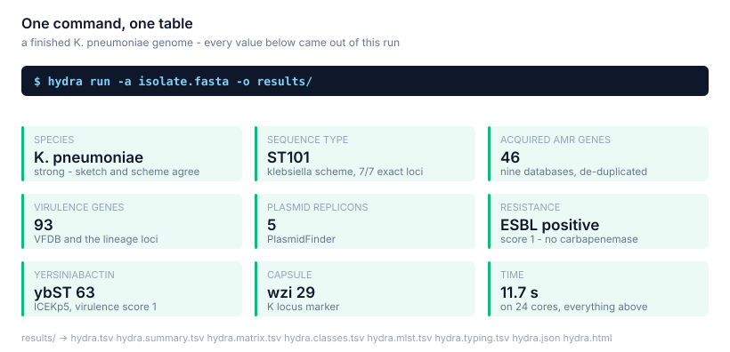
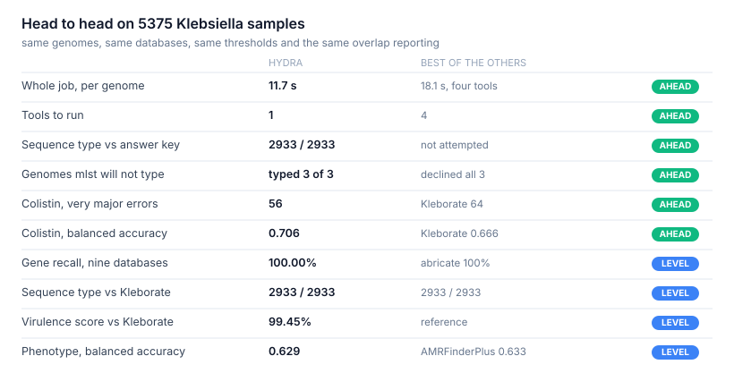
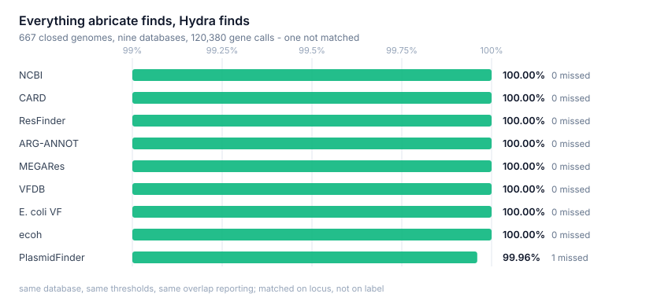
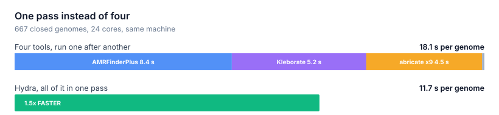

<p align="center">
  
</p>

<h1 align="center">Hydra</h1>

<p align="center">
  <strong>Acquired resistance and virulence genes, resistance point mutations,
  heteroresistance from reads, MLST, SCCmec and lineage typing —<br>
  one command, one table, one pass over one set of databases.</strong>
</p>

<p align="center">
  <a href="#install">Install</a> ·
  <a href="#examples">Examples</a> ·
  <a href="#results">Results</a> ·
  <a href="#commands">Commands</a>
</p>

---

**5375 *Klebsiella* samples: 100% of 2933 sequence types matched the recorded answer,
99.89% gene recall against abricate across nine databases, and the whole job in
11.7 s a genome against 18.1 s for the four tools it replaces.**

<p align="center"></p>

## Install

```bash
conda create -n hydra -c conda-forge -c bioconda \
    python=3.11 pip blast minimap2 samtools mash pysam pandas numpy scipy openpyxl
conda activate hydra
pip install https://github.com/iowa69/hydra/archive/refs/tags/v1.4.0.tar.gz

hydra db download     # genes, mutations, every PubMLST scheme, SCCmec, lineage, sketches
hydra db check        # reports anything missing
```

Databases live in `$HYDRA_DB`, default `~/.hydra/db`.

## Examples

### One isolate, everything on

```bash
hydra run -a isolate.fasta -o results/
```

```
[13:06:25] INFO Hydra v1.4.0 | 1 assemblies, 0 read sets | databases: ncbi, vfdb, protein | 24 threads
[13:06:38] INFO translated search of 5 contigs against AMRProt (9998 proteins); organisms: Klebsiella_pneumoniae
[13:06:40] INFO analysed 1 samples in 23.4s

1 sample(s), 312 element(s) detected
  results/hydra.tsv           one row per element, every field
  results/hydra.summary.tsv   one row per sample: species, ST, counts, scores
  results/hydra.matrix.tsv    presence/absence, samples x genes
  results/hydra.classes.tsv   elements per drug class
  results/hydra.mlst.tsv      scheme, ST, allele profile
  results/hydra.typing.tsv    lineage loci, SCCmec, virulence and resistance scores
  results/hydra.json          everything, with the version and command that made it
  results/hydra.html          self-contained report with clustered heatmaps
```

One line per isolate in `hydra.summary.tsv`:

```
sample      species                 confidence  scheme      ST   amr_genes  virulence  replicons  score  esbl
DRR199175   Klebsiella pneumoniae   strong      klebsiella  101  46         93         5          1      True
```

### A directory of assemblies, for surveillance

Scanned recursively, FASTA and FASTQ sorted out automatically. Adds the
presence/absence matrix, the drug-class recap and clustered HTML heatmaps.

```bash
hydra run assemblies/ -o results/ --preset surveillance -t 24
```

### A thousand samples from a sample sheet

Columns are `sample`, `assembly`, `R1`, `R2`. Leave a field empty when a sample has no
assembly or no reads.

```bash
cat samples.tsv
# KP001   KP001.fasta   KP001_R1.fq.gz   KP001_R2.fq.gz
# KP002   KP002.fasta
# KP003                 KP003_R1.fq.gz   KP003_R2.fq.gz

hydra run --input-list samples.tsv -o results/ --preset deep -t 24
```

### Raw reads, no assembly

Genes called by depth and breadth, MLST from reads mapped to the scheme's loci.

```bash
hydra run -1 sample_R1.fq.gz -2 sample_R2.fq.gz -o results/
```

### Assembly and reads together — heteroresistance

The consensus calls plus allele fractions at every catalogued position. This finds a
mutation carried by only some copies of a multi-copy locus, which an assembly
consensus reports as wild type.

```bash
hydra run -a sample.fasta -1 sample_R1.fq.gz -2 sample_R2.fq.gz -o results/
```

```
23S_G2577T; AF=0.200; 93/464 reads; HETERORESISTANT; ~1.0/5 operons; p=2e-152
```

### A staphylococcus — SCCmec falls out of the same run

Nothing needs to be told it is a staphylococcus.

```bash
hydra run -a mrsa.fasta -o results/
```

```
sample   species                 confidence  scheme    ST   SCCmec
N315     Staphylococcus aureus   strong      saureus   5    II(2A)
```

### One database, as a flat gene table

Writes abricate's column layout, so it drops into scripts that already read one.

```bash
hydra screen -d card assemblies/*.fasta --stdout
```

```
sample      database  element_type  gene          accession    sequence               start    end      %identity
DRR199175   card      AMR           AAC(6')-Ib7   KR091911.1   DRR199175_plasmid_1    41283    41888    99.83
DRR199175   card      AMR           ArnT          FO834906.1   DRR199175_chromosome   295364   297019   99.52
```

### Ask it what it can do

```bash
hydra presets                  # every preset and what it turns on
hydra run --list-databases     # what is installed, how big, which version
hydra run --list-organisms     # every -O value, with its mutation counts
hydra db info card             # source, licence and citation for one database
```

| Preset | For |
|---|---|
| `fast` | quickest useful screen: NCBI genes only |
| `standard` | the default: genes, translated search, mutations, MLST, typing |
| `deep` | every database, `--plus` elements, everything on |
| `surveillance` | multi-sample: all matrices, class recap, HTML heatmaps |
| `linezolid` | 23S heteroresistance from reads, plus *cfr*/*optrA*/*poxtA* |
| `amr` · `virulence` · `plasmid` | one job each |
| `enterobacterales` · `gram-positive` | organism-group defaults |
| `genes` · `elements` | flat gene table · typed element table |

A preset only sets defaults; anything passed explicitly wins.

## Results

667 closed references, 1279 clinical isolates, 2933 published genomes with the
sequence type recorded independently, 496 with assembly and reads. Every one
completed. Both tools always saw the same genomes, database, thresholds and overlap
reporting.

<p align="center"></p>

<p align="center"></p>

<p align="center"></p>

| | Hydra | Comparator |
|---|---|---|
| Sequence type vs the recorded answer, 2933 genomes | **2933 / 2933** | — |
| Sequence type vs Kleborate 3.2.4 | **2933 / 2933** | 2933 / 2933 |
| Sequence type vs `mlst` 2.35.0 | **99.85 – 100%** | 3 genomes it will not type, Hydra types |
| Gene recall, nine databases, 667 genomes | **99.89%** | abricate 100% |
| Distinct sequence types called | **539** | — |
| Virulence score vs Kleborate | **99.45%** | reference |
| Colistin, very major errors | **56** | Kleborate 64 |
| Colistin, balanced accuracy | **0.706** | Kleborate 0.666 |
| Point mutations vs AMRFinderPlus | **556 shared** | 1 unique to Hydra |
| SCCmec, strains with published types | **4 / 4** | — |
| Heteroresistance, 5% minority allele | **0.0453, p=1.1e-21** | — |
| Every documented flag | **69 / 69 clean** | — |

Every comparator, threshold and sample: **[docs/VALIDATION.md](docs/VALIDATION.md)** ·
**[docs/validation_klebsiella_samples.tsv](docs/validation_klebsiella_samples.tsv)**

## Commands

```
hydra run       full analysis of assemblies and/or reads
hydra screen    acquired-gene screening only, as a flat gene table
hydra db        list | import | download | bundle | info | check | remove
hydra presets   list the available presets
```

<details>
<summary><code>hydra run</code> options</summary>

**Inputs** — `INPUT...`, `-a/--assembly`, `-1/--r1`, `-2/--r2`, `--reads`,
`--input-list`, `--name`

**Databases** — `-d/--db` (names, or the groups `all`, `standard`, `amr`,
`virulence`, `nucl`, `core`), `--list-databases`

**Analysis** — `--preset`, `-O/--organism`, `--list-organisms`,
`--auto-organism/--no-auto-organism`, `--plus/--no-plus`, `--mlst/--no-mlst`,
`--scheme`, `--typing/--no-typing`, `--protein/--no-protein`,
`--point-mutations/--no-point-mutations`, `--heteroresistance/--no-heteroresistance`,
`--reads-mlst/--no-reads-mlst`, `--reads-variants/--no-reads-variants`,
`--report-synonymous`, `--assemble`

**Thresholds** — `--min-identity`, `--min-coverage`, `--protein-min-identity`,
`--protein-min-coverage`, `--min-contig-length`, `--report-overlaps`

**Reads** — `--min-depth`, `--min-gene-breadth`, `--min-allele-fraction`,
`--fixed-allele-fraction`, `--min-allele-reads`, `--min-base-quality`,
`--report-absent-sites`

**Output** — `-o/--outdir`, `--prefix`, `-f/--format`, `--stdout`, `--cell`,
`--rows`, `--columns`, `--element-types`, `--title`

**Runtime** — `-t/--threads`, `-j/--jobs`, `--db-dir`, `--tmpdir`, `--keep-temp`,
`-v/--verbose`, `-q/--quiet`
</details>

## Licence

MIT. The reference databases carry their own licences and citations —
`hydra db download --list` prints each one, `hydra db info NAME` prints them
individually.
